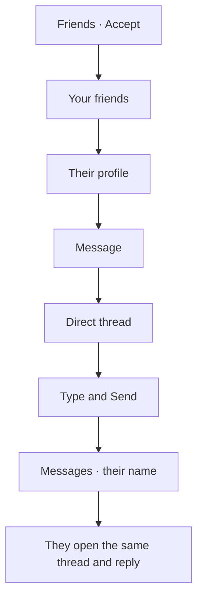

# Chat

> **Status:** Current path · 1 October 2026
> **What this is:** how two crew members talk after one has been added as a friend.
> Friendship is an accepted row in `connections`. Chat is a direct thread. This page starts at Accept and follows the conversation. How the request is sent is in [`friends-request.md`](friends-request.md).

A friend is someone who can be opened from **Your friends**. The conversation itself lives on **Messages**, in a thread titled with their display name.

---

## The journey

Two other doors reach the same friendship, then the same thread:

| How they became friends | What happens next |
|---|---|
| You tap **Accept** on **Requests** | They move into **Your friends**. Open the card, then **Message** |
| You send a request and they had already asked you | The request is accepted immediately. They are already in **Your friends** |
| They accept your request on their phone | You see them under **Your friends** the next time that list loads |

**Decline** does not lead to chat. Decline blocks the person. A block is heavier than a no, and a blocked pair cannot start a conversation.

---

## 1. Your friends

**Friends** is the tab. Subtitle “Your crew connections and pending requests.”

**Your friends** is the list of accepted connections. Each card is their display name, then role and base on the line under it. Tapping the card opens their profile.

The list has no **Message** button. The conversation starts on the profile, not on this card.

Empty list: “No friends yet. Add crew to your network with their Crew ID or suggested matches.” The action is **Add new friend**.

---

## 2. Their profile

Stack screen for that person.

| On the page | |
|---|---|
| Name | Display name |
| Line under the name | Role and base |
| Crew ID | “Crew ID: CREW-8F2K-9M4X” when they have one |
| Verified | Badge, when they are verified |
| Rank | Only if they chose to show it |
| Activities and interests | Lime pills, in two labeled groups, when they picked any |

Actions, top to bottom: **Connect**, **Message**, **Report**, **Block**.

**Connect** sends a friend request with no message. Once they are already friends, this button is still on the page. The request function answers “You are already connected.” It does not open chat.

**Message** is the door into the thread.

**Block** reports and blocks them, then leaves the profile. After a block they should not remain a friend you can message.

---

## 3. Opening the thread

**Message** looks for a direct thread that already includes both of you.

- One exists: that thread opens.
- None exists: a new direct thread is created and opened.

The thread screen is a stack. Your bubbles sit on the right, in the accent tint. Theirs sit on the left, on a card. There is no date stamp and no read receipt on the bubble.

The composer is one field, placeholder “Type a message…”, and **Send**. An empty field does not send. **Send** clears the field, writes the text, and the new bubble appears in the list. New messages in this thread replace the list while the screen is open.

Opening the thread marks it read for you.

**Report** sits under the composer. It names a reason and optional details, and files them against the other person in the thread.

---

## 4. Finding the conversation later

**Messages** is its own tab. Title **Messages**.

Each row is a card: the other person’s display name, then the latest message on one line. A thread with no messages yet reads “No messages yet.” Tapping the card opens the same thread.

Empty inbox: “No conversations yet. Connect with crew or join an event to start chatting.”

The first time this tab is opened in a session, a safety sheet can appear: “Meeting someone new?” with “Prefer a public place or a group meetup. You can share plans with a friend outside the app.” Dismissing it hides it for that session.

A direct thread and an event chat share this inbox. An event chat is titled with the meet’s name, or “Event chat” if the meet has no title. That thread is created when someone creates the meet or marks themselves going. It is not the friend conversation. The friend conversation is the direct thread titled with their name.

---

## What this version still gets wrong

The journey above is the one the screens are aimed at. A few pieces of the build do not yet carry it.

| | |
|---|---|
| The other person is not added when the thread is created | A new direct thread only records you as a participant. They may never see it under **Messages**, because that list is “threads I belong to” |
| **Message** is not limited to friends | The same button is on every profile, including someone you have not added |
| **Your friends** cannot start chat | You have to open the profile first |
| Beta | While the app is in beta holding, **Messages** is not one of the screens they can open. Chat waits until launch |
| Sent requests | A request you sent, still waiting, is not on **Friends**, so there is no thread to open from it |

Photos, voice, and a typing indicator are not part of this version. Neither is an unread count on the tab.
