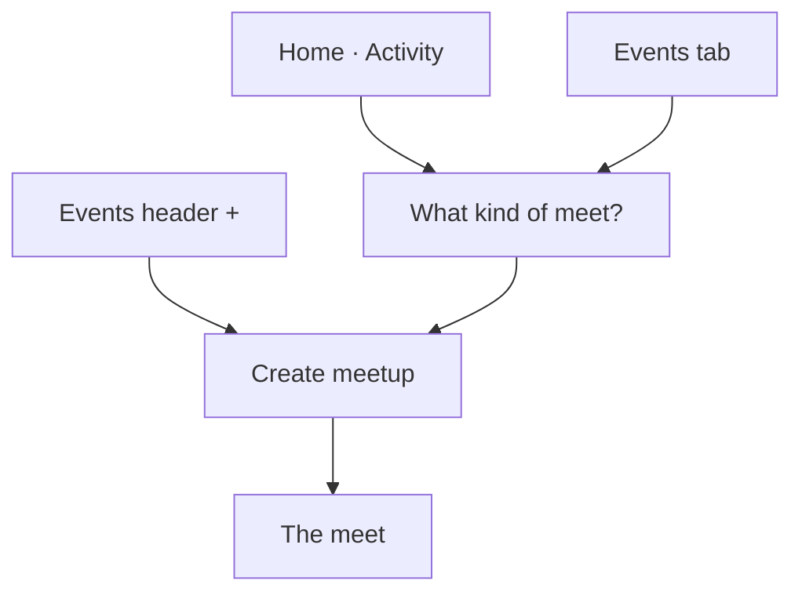
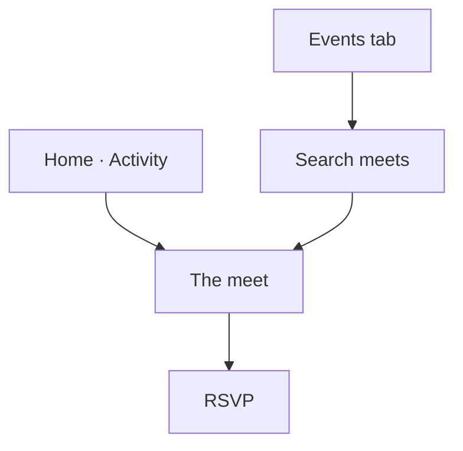

# Events

> **Status:** Current, with one addition · 1 October 2026
> **What this is:** how a crew member finds a meet and how they create a public or private one.
> The addition is that a meet can carry both **activities** and **interests**, and discovery can search by them.

A public meet is visible to verified crew. A private meet is for friends. Both are the same event. The only difference is who can see it.

Activities are things people do together: dinner, coffee, hiking, gym. Interests are background: food, travel, music, museums. They are the same lists a person already picks on their profile. A meet should be able to use both, so someone looking for a dinner, or for people who like music, can find it.

---

## What exists today

### Home

Home has three tabs. **Activity** lists recent connections and upcoming meets. A platform meet is titled “CrewUp Event: …” and the line under it is the city and date. Tapping a meet opens it.

If Activity is empty, the empty state offers **Create Event**. That opens **What kind of meet?**

| Choice | Meaning | Who can see it |
|---|---|---|
| Public Meet | “Create a meet for everyone in the community to join.” | Verified crew |
| Private Meeting | “Create a meet for your invited friends only.” | Friends |

Closing the sheet stays on Home. Choosing one opens the create form with that visibility already selected. The form still shows Public Meet and Private Meeting, so they can change it before saving.

### Events tab

The Events tab is the discovery list. There is no separate search field yet.

Three pills filter the list: **All**, **CrewUp Events**, **Community**. CrewUp Events are hosted by the platform. Community is everyone else.

Each row is a card: title, a **CrewUp Event** badge when it is hosted by CrewUp, then “city · date and time”. Tapping the card opens the meet.

Empty list: “No upcoming meets. Browse events or create one for your layover city.” The action is **Create Event**, which again asks public or private.

The header **+** is different. It opens the create form directly and skips the public-or-private sheet. The form then starts as a public meet.

### Create

Stack title **Create meetup**. One scroll, then **Save**.

1. **Activity.** A field labelled Select activity. Tapping it opens a sheet. The person’s own activities are listed first, under **Your activities**, then **All activities**. Interests are not in this sheet. More than one activity can be selected. This can be left empty.
2. **When.** Date and time. Must be in the future. “Choose when your meet starts.”
3. **Where.** City, searched by city or country. Venue, and an optional address.
4. **Who.** Public Meet or Private Meeting, and a stepper for the number of attendees. At least one.
5. **What.** Meet title, for example “Sunday coffee in Shibuya”. Notes: where to meet, dress code, or what to bring. Free-typed tags, with quick tags such as alcohol-free, halal-friendly, women-only, karaoke, dinner, coffee, hiking.

Save creates the meet, attaches the chosen activities, opens a group thread for it, and replaces this screen with the meet itself.

### The meet

Title, **CrewUp Event** and “Hosted by CrewUp” when it is a platform meet, then city and start time. Notes sit in a card. Chosen activities are one line, separated by middots. Then “N attending”.

- Not going yet: **RSVP**. That marks them going.
- Already going: the button reads **Going** or **Waitlisted** and does nothing further. They cannot leave from this screen.
- **Report** opens a report of the meet and its host.

There is no edit button on this screen. A separate edit route exists for title, city, and description, and it is not linked from here. Platform meets cannot be edited that way.

---

## Addition: activities and interests on the meet

The activity sheet today only offers activities. Interests stay on the profile and never reach a meet. Quick tags also repeat a few activity names (dinner, coffee, hiking, karaoke), so “what this meet is” is split across two controls.

Replace that split with the same two groups the profile already uses.

| Group | Examples | On the create form |
|---|---|---|
| Activities | Dinner, coffee, hiking, gym | Pills. Optional. The person’s own activities come first. |
| Interests | Food, travel, music, museums | Pills, in their own group under activities. Optional. |

Both are saved on the meet. The detail screen and the discovery cards show them as the small lime pills, activities in one row and interests in another. A missing group is left off the card.

Quick tags stay for practical notes only: alcohol-free, halal-friendly, women-only. Dinner, coffee, hiking, and karaoke come out of the quick-tag list, because those are activities.

Neither group is required. A meet can still be saved with a title, a time, and a city.

---

## Flow A — Home to a new meet

1. From Home Activity, or from an empty Events list, they tap **Create Event**.
2. They choose **Public Meet** or **Private Meeting**.
3. The create form opens with that choice filled in.
4. They pick activities and interests, then date, time, city, and a title.
5. **Save** opens the meet.

The Events header **+** skips step 2 and lands on the form as a public meet. They can still switch to Private Meeting on the form.

---

## Flow B — Discover, open, and join

### Events tab

Stays the front door. **All**, **CrewUp Events**, and **Community** stay as they are. A search field is added at the top of this tab. It is the search page for meets: one field, then the same cards underneath.

Search matches the title, the city, an activity name, or an interest name. Clearing the field shows the filtered list again. No matches uses the same empty state as an empty list, and still offers **Create Event**.

Cards gain the activity and interest pills under the city and time, so a person can see what the meet is before opening it.

### Home

Activity rows that are meets keep opening the meet. They do not become the search page. Search lives on Events.

### The meet

Unchanged in structure, plus the two pill rows. **RSVP** still marks them going. **Going** still does not let them leave. **Report** stays.

A private meet does not appear in search or on the Events list for someone who is not a friend of the host. A public meet does.

---

## Pages

| Frame | Title | Role |
|---|---|---|
| Home, Activity | Activity | See meets, or start a new one |
| Kind of meet | What kind of meet? | Public or private |
| Events | Events | Browse, filter, and search |
| Create | Create meetup | Activities, interests, time, place, title |
| Meet | The meet’s title | Read it, RSVP, or report it |
