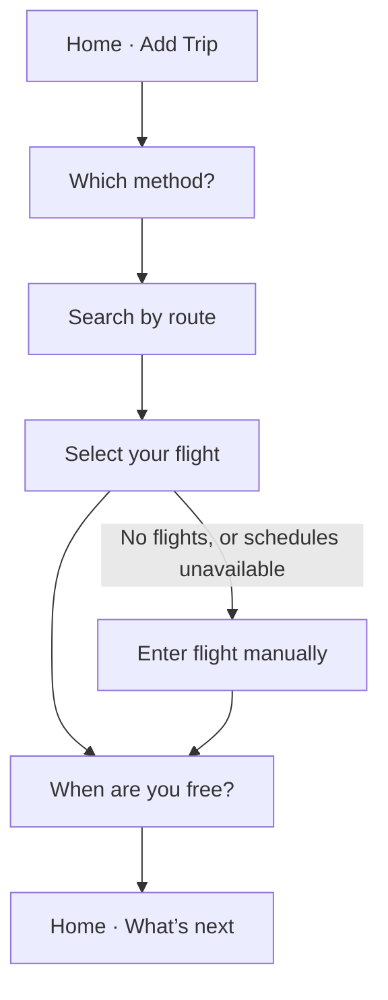
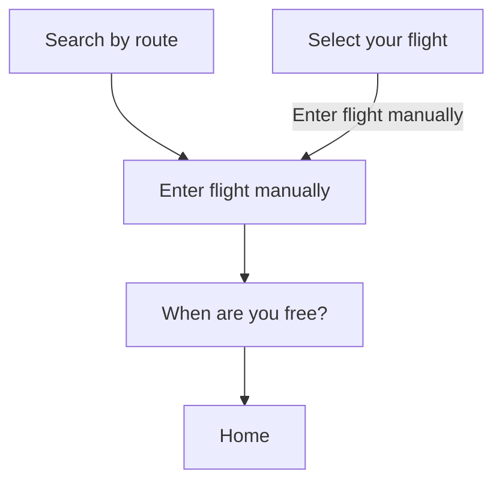
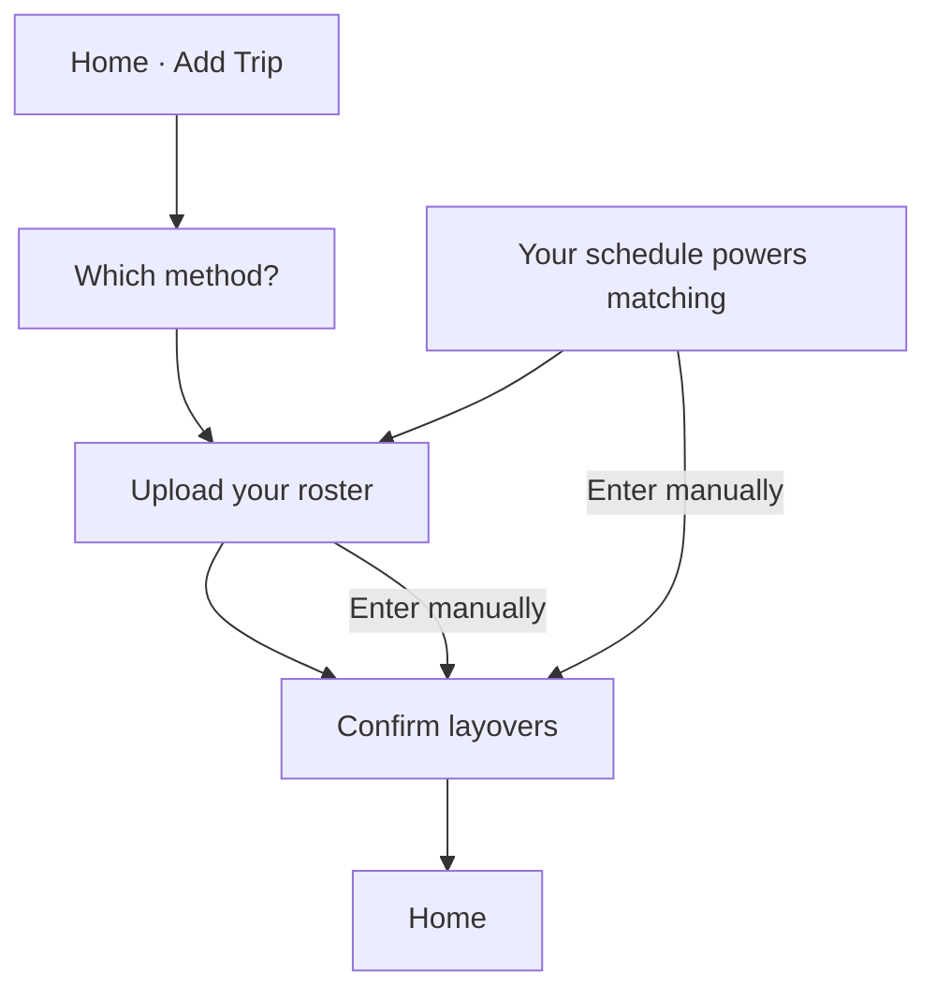

# Requesting a flight

> **Status:** Current · 1 October 2026
> **What this is:** the screens from Home through a saved trip, written so they can be exported as design pages and a user flow.
> Crew are not booking a ticket. They are telling CrewUp which flight they are on, and when they are free after landing, so the app can match them with other crew.

Three ways in. All of them start from the same place on Home, and search and manual entry finish on the same “When are you free?” screen.

| Flow | What the person does | What gets saved |
|---|---|---|
| Search | Pick a route and a date, then choose the flight from that day’s departures | One flight, plus a free window in the arrival city |
| Manual flight | Same route and date, then type the flight number and the times from the roster | One flight, plus the same free window |
| Roster upload | Upload a roster PDF or photo and confirm the layovers | A set of layovers, and trips built from them |

---

## How someone gets here

### Home

The top of Home is the profile: photo with a status dot, display name, airline and role, then three counts — Trips, Cities, Connections. Trips opens the trip list.

Under that is a full-width **Add Trip** button. If they have no trips yet, a line under the button reads “Add your next trip to find crew flying with you.”

Below the button, Home has three tabs: **What’s next**, **Matches**, and **Activity**. What’s next is empty until a trip exists: “No upcoming trips. Add a trip to start matching with crew on your route.”

**Add Trip** opens a sheet titled **Which method?**

| Choice | Icon | Body copy | Next screen |
|---|---|---|---|
| Search by flight | Airplane | “Find one flight by number or route and add it as a trip.” | Search by route |
| Roster upload | Upload | “Upload your roster PDF and add a whole month of layovers at once.” | Upload your roster |

Closing the sheet returns to Home. The same sheet is also opened by **Add Trip** on **Your trips**.

### After onboarding

The first time someone finishes launch onboarding they see **Your schedule powers matching**, with the line “Upload a roster or enter layovers manually. CrewUp uses coarse city windows only — never your full roster with others.”

| Button | Next screen |
|---|---|
| Update schedule | Upload your roster |
| Enter manually | Confirm layovers, empty, so they can type a city and dates |
| Later | Home |

### Your trips

Title **Your trips**, then **Add Trip** (the same method sheet). Each saved trip is a card: flight and route, date, local departure and arrival times, and “Free until …” in the arrival city. **Remove trip** is on the card. Empty state matches Home: “No upcoming trips.”

---

## Flow A — Search a flight

### Page 1 — Search by route

Header is the stack back control. The page is one scroll.

**Search by route.** Two large cards side by side, with a swap control between them.

- Left card is **Departure**. Right card is **Arrival**.
- An empty card shows the word Departure or Arrival. A chosen card shows the IATA code large, and the city under it.
- Departure starts as the person’s base airport when they have one.
- Hint under the cards: “Tap an airport to change it. Use ⇄ to swap.”
- Tapping a card opens an airport search. The field placeholder is “City, airport, or IATA code.” Empty results: “No airports match your search.”

A hairline, then **When are you flying?** centered.

- Until both airports are chosen, the date control is dim and the line reads “Choose departure and arrival above to pick a date.”
- Then a date field, **Select flight date**. Dates before today are not offered.
- After a date is chosen: “Tap Search flights to see scheduled departures for this route.”

Footer, in order:

1. **Search flights** — primary. Disabled until departure, arrival, and date are set.
2. **Add flight manually** — secondary. Same disabled rule. This is Flow C, already holding the route and date.
3. **Cancel** — returns to the previous screen.

### Page 2 — Select your flight

Centered header:

- Title **Select your flight**
- Route as `HKG → LHR`
- The date in words
- “Flights from HKG to LHR on this date”

Then a list of flight cards. While they load, the list is a skeleton. Each card:

- Flight number on the left, airline name on the right
- Departure IATA, local time with the zone, and the local date
- An arrow
- Arrival IATA, local time with the zone, and the local date, aligned to the right
- If the arrival calendar day is not the departure day: “Arrives next day”, “Arrives +N days”, “Arrives previous day”, or “Arrives −N days”

Tapping a card selects it: lime border and a tinted fill. Only one card stays selected.

Footer:

1. **Continue** — disabled until a flight is selected. Opens When are you free?
2. **Back**

If the search returns nothing:

- “No flights found for this route and date.”
- “Double-check the route and date, or add the flight yourself.”
- **Enter flight manually**

If schedules cannot be loaded:

- “Flight schedules are unavailable right now. Try again shortly or add the flight yourself.”
- **Retry** and **Enter flight manually**
- If the session has lapsed: “Sign in again to search for flights.” No retry.

Times on the card are airport-local: departure in the origin’s timezone, arrival in the destination’s timezone. The person never sees a vendor name or an error code.

### Page 3 — When are you free?

Shared with the manual-flight flow. Centered header:

- Title **When are you free?**
- `CX255 · HKG → LHR`
- The flight date
- “Lands 15:00 GMT on 21 Sep” (arrival local time and date)
- “Tell crew when you're free in London. We never share your full itinerary.”

Two date-and-time pairs, in the arrival city’s local time:

- **Free from** and **Start time**. They open on the landing time.
- **Free until** and **End time**. They open eight hours after landing. Free until cannot be before free from.

Footer:

1. **Save trip**. While it saves, the button waits. On success the label becomes “Trip saved! Finding matches…” and the app returns to Home.
2. **Back**

If save fails: “Could not save your trip. Try again.”

What other crew can learn from this is the arrival city and the free window, not the whole duty.

---

## Flow B — Enter a flight manually

This is the path when the flight is not in the search results, or the person already knows they want to type it.

**Add flight manually** on Search by route, and **Enter flight manually** on Select your flight, both open this page. The route and the date are already chosen. They are not asked again.

### Page — Enter flight manually

Centered header:

- Title **Enter flight manually**
- `HKG → LHR`
- The date already chosen
- “Add your HKG to LHR flight using the times printed on your roster.”

Fields:

| Field | Notes |
|---|---|
| Flight number | Required. Placeholder “e.g. CX255”. Letters are uppercased. Error: “Enter a flight number like CX255.” |
| Airline code | Optional. Placeholder “e.g. CX”. Two or three letters, or blank. |
| Departure date and time | Labelled with the origin code, “Departure date (HKG local)” and “Departure time (HKG local)”. |
| Arrival date and time | Labelled with the destination code. Arrival must be after departure: “Arrival must be after departure.” |

The service day is the departure date in the origin’s local time, not a sliced UTC clock.

**Continue** opens the same **When are you free?** page as search. The header there uses the flight number they typed. **Back** returns to the route page or the results page, whichever they came from.

---

## Flow C — Roster upload

### Page — Upload your roster

Stack title **Upload roster**.

- Title **Upload your roster**
- “Choose the roster PDF or screenshot from your airline. We read your flights and layovers so you can check them before anything is saved.”
- Smaller line: “Names, staff numbers and hotels are removed before your roster is read.”

**Choose file** opens the document picker. Accepted files are PDF, PNG, JPEG, HEIC, and WebP. While it reads, the button says “Reading your roster…”.

A roster that yields layovers opens **Confirm layovers** with those rows filled in.

**Enter manually** skips the file and opens Confirm layovers empty.

Errors stay on this page, and each one points back at typing the trip instead:

| Situation | Message |
|---|---|
| No layovers found | “We didn't find any layovers in this roster. You can add them manually.” |
| Import unavailable | “Roster import is unavailable right now. You can add your trip manually.” |
| Timed out | “That took too long. Try again or add your trip manually.” |
| Too many imports | “Too many imports right now. Try again in a few minutes.” |
| Could not read it | “We couldn't read this roster. You can add your trip manually.” |
| No readable text | “This file has no readable text. Try the PDF from your airline instead of a scan or screenshot.” |
| Too large | “This file is too large. Rosters up to 10 MB and 20 pages are supported.” |
| Wrong type | “This file type isn't supported. Upload a PDF, PNG or JPEG.” |

### Page — Confirm layovers

Stack title **Confirm layovers**. Title **Confirm layovers**.

When the upload found layovers, each one is a card:

- City as the card title, or “City TBD”
- **City**
- **Start** and **End**, shown as date-time text the person can correct

When they arrived with no file, the page is a blank form instead of cards:

- **Layover city**
- **Start** and **End** as dates
- **Add entry**, which turns that form into a card

**Save** writes the layovers, builds trips from them, and returns to Home. Nothing is saved before this button.

This page is the layover list, not the single-flight form in Flow B. It does not ask for a free window after landing. Search and manual flight entry do.

---

## What Home shows after a trip is saved

**What’s next** lists upcoming trips: flight and route, the departure date, local times, and a status dot.

**Matches** stays empty until another crew member overlaps that city and those dates: “No overlapping crew yet. Save a trip with your availability to discover crew nearby.” A match can be on the same flight, the same route, or also in that city. **Wave** sends a connection request. Home then toasts “Connection request sent.”

---

## Pages to export

| Frame | Title on screen | Used by |
|---|---|---|
| Home | Home | All three flows |
| Method sheet | Which method? | Search, roster |
| Route | Search by route | Search, manual flight |
| Results | Select your flight | Search |
| Results, empty | No flights found | Search → manual |
| Results, unavailable | Flight schedules are unavailable | Search → manual or retry |
| Manual flight | Enter flight manually | Manual flight |
| Free window | When are you free? | Search, manual flight |
| Upload | Upload your roster | Roster |
| Confirm | Confirm layovers | Roster, and “Enter manually” from the schedule intro |
| Schedule intro | Your schedule powers matching | First launch only |
| Trip list | Your trips | Later adds and removals |

---

## Rules that stay on every frame

- Search is by route and date. The method sheet mentions a flight number; the form itself asks for departure, arrival, and date. The flight number is chosen from the results, or typed on the manual page.
- Clocks are local to the airport they belong to, and labelled with that zone.
- An arrival on another calendar day is written out. It is not left as a bare time.
- The free window is the only thing used to show availability. The full roster is not shown to other crew.
- A failed search always offers another way forward: retry, or enter the flight from the roster.
