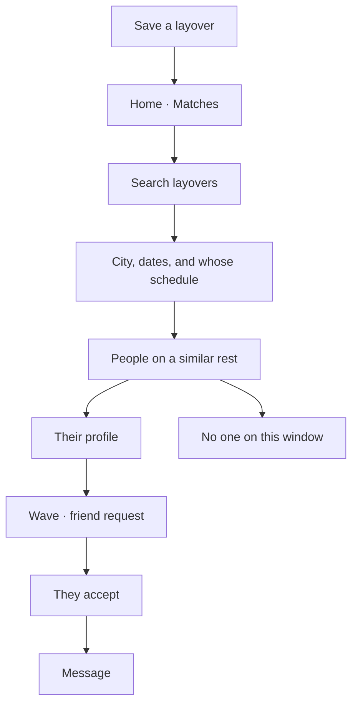

# Finding crew on the same layover

> **Status:** Proposal · 1 October 2026
> **What this is:** how a crew member searches for and discovers other people who are free in the same city, on an overlapping rest.
> Saving a trip already writes city windows and can already list overlaps on Home. This page is the journey for looking those people up on purpose. How a trip is saved is in [`flight-request.md`](flight-request.md) and [`roster-upload.md`](roster-upload.md). Talking after you add someone is in [`chat-feature.md`](chat-feature.md).

CrewUp does not publish a full roster. What other people can be matched on is a city and a time window: where you are free, and when that window overlaps someone else’s.

---

## What the app already does

A layover enters the app in one of three ways, all from **Add Trip** on Home:

| Way in | What is saved | Free window |
|---|---|---|
| Search by flight | One flight, then “When are you free?” in the arrival city | Yes. They set the end of the rest |
| Enter the flight manually | The same flight and the same free window | Yes |
| Roster upload | One card per layover on **Confirm layovers**: city, start, end | The layover itself is the window. There is no separate “when are you free?” step |

Saving writes a trip and a stay. A stay is the city plus a start and an end. When a trip, a flight leg, or a stay changes, matches for that trip are recomputed.

Home then has a **Matches** tab. It is a list, not a search. Up to twelve people, one row each. The row is their name, a reason, and **Wave**. Tapping the row opens their profile. Wave sends a friend request: “Hi — looks like we're crossing paths!” A toast says the request was sent. Wave does not open a chat. Chat starts after they are friends, from their profile. See [`chat-feature.md`](chat-feature.md).

The reason on the row is the strongest overlap with that person:

| Reason | When it is used |
|---|---|
| On your flight | You share a flight |
| Same route | Same departure and arrival airports, and the departures are within three hours. This is weaker than sharing the flight |
| Also in {{city}} | Your stays in that city overlap in time |

Empty **Matches**: “No overlapping crew yet. Save a trip with your availability to discover crew nearby.”

A separate screen, **Who is around**, can list people present in one city. It is not linked from Home search, and it does not take a date. It is not this feature.

---

## The journey this proposal adds

The person already has at least one layover saved. Search does not replace **Add Trip**. It is how they look through the overlaps that saving a layover is supposed to unlock.

### Where search starts

Two doors, same results.

| Door | When they use it |
|---|---|
| **Matches** on Home | They want everyone who overlaps any layover they have saved |
| A layover they already saved | They want people on that rest only. The layover’s city and dates are already filled in |

**Matches** keeps the list it has today when they have not typed a search. Search narrows that list. It does not create a second inbox of people.

### What they can search

One field, then three filters. The field is the city: a name or an IATA code, the same kind of place they already pick when they add a trip.

| Filter | Choices | Default |
|---|---|---|
| Whose schedule | My layovers · This city | My layovers |
| When | The dates of the layover they picked, or a from–to they set | The overlap they already saved |
| How close | On my flight · Same route · In the city with me | All three |

**My layovers** only returns people whose window overlaps a stay this person has saved. **This city** is for looking ahead: “who else is in Hong Kong between these dates,” even if they have not saved that city yet. Results in that mode still only include people who chose to be discoverable. It does not browse the whole membership.

Dates before today can stay in the list only when the layover has not ended. A rest that is already over does not appear.

### A result

Each row is one person, not one flight. If you overlap them in two cities, they appear once, on the stronger reason. Same rule as **Matches** today: a shared flight outranks the same route, which outranks a city overlap.

| On the row | |
|---|---|
| Name | Display name |
| Reason | On your flight, Same route, or Also in {{city}} |
| Window | The overlap, in local time at that city. Example: “HKG · 2 Oct, 14:10 – 3 Oct, 09:40” |
| Line under the name | Role and base, when they have them |
| Shared tags | Activities or interests you both picked, when there are any. At most a few pills, not the whole profile |

Tapping the row opens their profile: name, role, base, Crew ID, activities, interests. From there the existing actions apply. **Wave** sends the crossing-paths request. **Message** is for after they are in **Your friends**, as in [`chat-feature.md`](chat-feature.md). Search itself does not start a thread and does not send a request until they tap Wave.

### Empty and missing schedule

| Situation | What they see |
|---|---|
| They have no layover saved | “Save a trip with your availability to discover crew nearby.” Action **Add Trip**, which opens **Which method?** |
| They searched a city and a date and nobody overlaps | “No crew on this layover yet.” They can widen the dates or clear the city and return to all of their overlaps |
| They turned discovery off | The list explains that other crew cannot be matched until their trips are visible again |

---

## Who is allowed to appear

Search reads the same matches the app already computes. It does not invent a second rule.

A person is a result only when all of these are true:

- Both trips are active, and neither person has blocked the other.
- The windows actually overlap, or you share a flight or a close route.
- Visibility allows it. **Off** removes them from discovery. **Friends** only matches people who are already friends. **Same airline** only matches verified crew at that airline. **Verified crew** matches any other verified member. If either side is tighter, the tighter rule wins.
- What is compared is the city window, not the roster line. Flight number and route are used for “On your flight” and “Same route.” The rest of the pairing stays on their phone.

A long overlap and a short one can both match. The row should say how long the windows overlap so a twenty-minute connection is not presented as a night in the city. A stay of about eight hours or more is the one worth surfacing first. That weighting already exists on the match. Search should keep it, and let them filter down to the longer rests.

---

## What this proposal is not

It is not a flight search. Finding a flight is [`flight-request.md`](flight-request.md). Finding a person comes after the layover is saved.

It is not the Events tab. A meet in a layover city is [`events.md`](events.md). This search returns crew, not meets.

It does not show someone who has no stay in that city on those dates, and it does not show a person who set their trips to off. Suggested friends on **Add friend** stay a separate list: same base, not the same layover.
