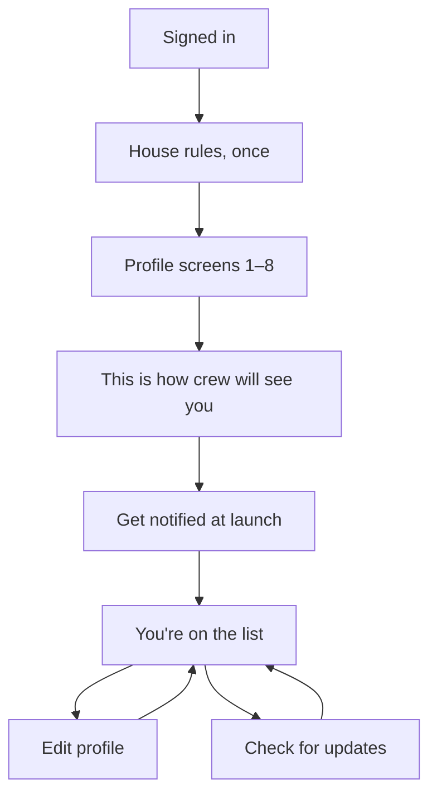

# CrewUp — Beta onboarding

> **Status:** Current · 1 October 2026
> **What this is:** onboarding while the app is in beta.
> The profile screens are the same as [onboarding.md](./onboarding.md). This document is the beta ending: the preview of how other crew will see the account, the wait to launch, and what a person can do while they are on the list.

Beta does not open the app. Finishing the profile puts someone on the list. Home, trips, events, friends, and chat stay closed until the app mode changes to launched.

---

## The path

House rules and screens 1–8 are in [onboarding.md](./onboarding.md). In beta they lead here, not to home.

| After the preview | What they do |
|---|---|
| Get notified at launch | **Notify me** asks for a push notification. **Skip** does not. Either way they join the list. |
| You're on the list | They wait. **Edit profile** changes the account. **Check for updates** asks whether the app has opened. |

If a required detail is still missing, **I'm Done** names it and stays on the preview. Activities and interests can be empty.

If they leave and come back before they have joined, they resume the screen they were on. After they have joined, every launch opens **You're on the list**.

---

## This is how crew will see you

This is the last profile screen, and the only full preview in beta. The title is **This is how crew will see you**. The button is **I'm Done**.

The top is centered:

- Photo, if they added one
- Display name, with a male or female icon immediately to its right when they chose to show gender
- @username
- **Member since**, as today, yesterday, or a count of days, months, or years. Never a clock time

Under that, each block is its own card. A block with nothing in it is left off.

| Section | What other crew would see |
|---|---|
| Crew | Role, airline, and base. The label sits on the left, the value on the right. |
| Places | Residing city and home city, each with its country |
| Languages | Small lime pills |
| Activities | Small lime pills |
| Interests | Small lime pills |

Date of birth and phone are not on this card. Hometown coordinates are not on it. Rather not say, or a hidden gender, leaves the icon off.

**I'm Done** does not open the app. It opens **Get notified at launch**.

---

## Get notified at launch

Title **Get notified at launch**. The line under it: “We'll send one notification when CrewUp opens to everyone.”

| Button | Result |
|---|---|
| Notify me | Asks the phone for notification permission, then joins the beta |
| Skip | Joins the beta without that permission |

There is no third choice. Both buttons end on **You're on the list**.

If the profile is not actually complete, they are sent back to the preview instead of the list.

---

## You're on the list

This is the beta phase. There is no back button and no progress bar.

Title **You're on the list, {display name}.** The line under it: “Thanks for joining the CrewUp beta. We'll let you know as soon as the app opens.”

A short card sits under that title. It is not the full preview. It shows the photo, the display name, @username, and one line of role and base, such as “Cabin crew · HKG · Hong Kong”. The full preview is the screen they already passed.

| Control | What it does |
|---|---|
| Edit profile | Opens the same editor as [onboarding.md](./onboarding.md). Saving a section returns here. It does not advance them into the app. |
| Check for updates | Asks the server which mode the app is in, and reloads their place in the flow |
| Sign out | Returns them to sign-in. The next sign-in brings them back to this screen |

While this screen is their home, the app sends them back to it if they open Home, a trip, an event, Friends, or a chat. The only profile routes that stay open are Edit profile and its sections.

---

## Flows while the app is in beta

### Join

Sign in, accept the house rules once, fill screens 1–8, read the preview, tap **I'm Done**, then notify or skip. They land on the list.

### Change how they look

From the list, **Edit profile**. The header there matches the preview: photo, display name and gender icon, @username, Member since. They can change the name, the display name, about you, languages, activities and interests, places, crew, or the private phone. The Crew ID is on that page too. None of this unlocks the rest of the app.

### See if the app has opened

**Check for updates.** If the mode is still beta, they stay on the list. Nothing else changes.

### Leave and return

Sign out, or kill the app. Signing in again opens **You're on the list**, not the profile screens.

### Resume an unfinished profile

If they have not tapped through **I'm Done** yet, the next launch opens the profile screen they had reached, starting with house rules if those were never accepted on this device.

---

## When beta ends

Joining the beta is not the same as finishing onboarding. The account is still waiting.

When the app mode becomes launched, **Check for updates** — or the next launch — does not drop them on Home. They return to **This is how crew will see you**, with the line “Welcome back — check your details are still right.” Their answers are already filled in. After that preview they take the launch steps: privacy, community guidelines, and notifications. Only then does Home open.
