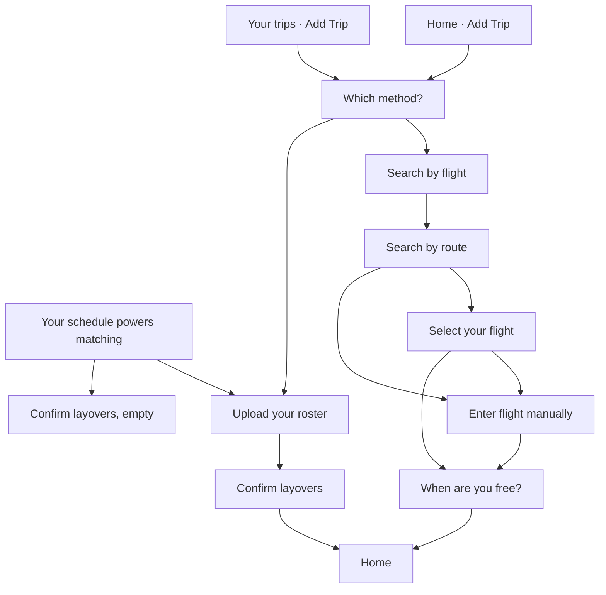
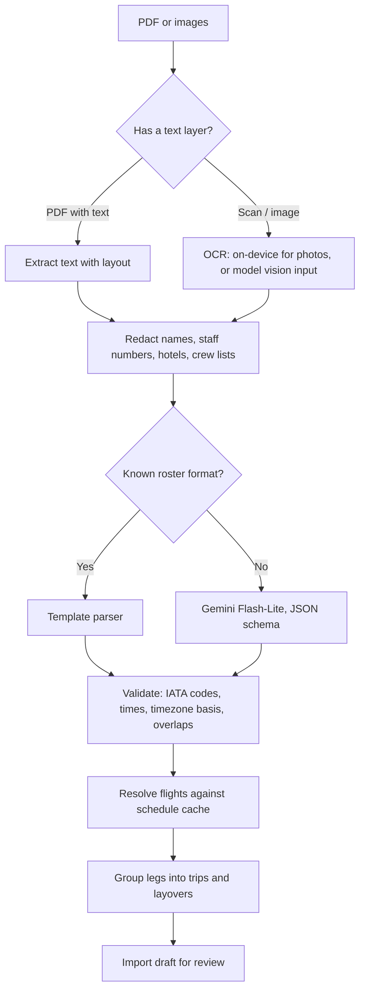

# Roster Upload and Batch Schedule Import

## Document status

| Field | Value |
|---|---|
| Status | **Partly implemented** — the Add Trip flow in §5 is what the app does now. Gemini extraction runs inside the existing upload. Share sheet, review-month, `roster_imports`, and same-flight matching are still the design in §5.8 onward |
| Date | 1 October 2026 |
| Scope | `crew-up-app` roster upload and review; `crew-up-nhost` parse, import, and batch trip commit |
| Builds on | [`trips.md`](trips.md) (`user_trips`, `flight_instances`, `trip_flight_legs`, `trip_stays`, `trip_matches`, `roster_imports`), [`flight-request.md`](flight-request.md) (schedule cache) |
| Model setup | [`gemini-flash-lite.md`](gemini-flash-lite.md) |
| Replaces | Mock `parseRoster` action and the single-trip-per-row confirm path |
| Primary goal | A crew member turns the roster PDF on their phone into a month of trips in under a minute, and sees which crew they share flights and layovers with |

---

## 1. Summary

Cabin crew and pilots receive their roster as a PDF — usually by email, an airline crew app, or a message — on the phone they already carry. Typing thirty flights into Add Trip is not realistic, so most crew will only get value from CrewUp if the roster import works.

This proposal:

1. Lets crew send the PDF straight to CrewUp from the phone's share sheet, or pick it in the app.
2. Extracts every duty in the roster period with a text-first pipeline, using an AI model only where rule-based parsing cannot.
3. Groups flights into trips (pairings) and layovers automatically.
4. Shows one review screen for the whole month, then commits everything in a single batch.
5. Links each roster flight to the shared `flight_instances` row, so crew on the **same flight** find each other through the matching rules already defined in `trips.md` §5.

**Model recommendation, in one line:** use **Gemini Flash-Lite** with structured JSON output. Use its **free tier for development only, with synthetic rosters**, and the **paid tier for real users** (under US$0.01 per roster), because free-tier content can be used for model training and read by human reviewers. See §6.

---

## 2. What crew actually receive

Rosters come out of airline crew-scheduling systems (for example AIMS, Sabre, Jeppesen, Lufthansa Systems NetLine, CAE). Formats differ, but most share these traits:

| Trait | Implication for parsing |
|---|---|
| Usually a **text PDF** generated by software, not a scan | Text can be extracted exactly without OCR or AI for most files |
| One page per week or month, often a grid or a list | Layout-aware extraction is needed; a flat text dump loses columns |
| Duty codes mixed with flights: `OFF`, `SBY`/`RSV` (standby/reserve), `DH`/`DHD` (deadhead), training, ground duty, leave | Only flights and deadheads become legs; the rest are skipped or shown as "not imported" |
| Pairing / trip codes grouping several legs | Useful for grouping legs into one trip |
| Times in **UTC**, **local station time**, or **base time** — sometimes stated only in a page header | Every time must carry its basis; wrong basis shifts a flight by hours and breaks same-flight matching |
| Personal and third-party data: crew name, staff number, hotel, and sometimes the **full crew list** for each flight | Must be stripped before any external model and never stored (§9) |
| Screenshots of crew apps instead of PDFs | Needs OCR; on-device OCR is free (§6.4) |

---

## 3. Current state

| Area | Today | Problem |
|---|---|---|
| Upload | `app/roster/upload.tsx` picks an image or PDF, uploads to the `rosters` bucket, calls `parseRoster` | Works |
| Parse | `functions/client/roster-parse.ts` reads PDF text, redacts it, and extracts duties with Gemini Flash-Lite (phase 1, [setup](gemini-flash-lite.md)) | Still synchronous; returns derived layovers only, not flight rows |
| Review | `app/roster/confirm.tsx` shows raw ISO date strings | Hard to review a month of duties |
| Commit | `insertRosters` writes legacy `rosters`, then `createTripsFromRosterLayovers` calls `/client/trips/create` once per row | Rows with a flight number are **skipped**, so roster flights never become `trip_flight_legs` and can never produce a same-flight match. One network call per row, with no rollback if one fails |
| Re-upload | Not handled | Next month's upload duplicates overlapping trips |
| Phone entry | In-app picker only | Crew have to save the PDF to Files first, then find it again from inside CrewUp |

---

## 4. Goals and non-goals

### Goals

1. **Two taps from the PDF:** Share → CrewUp → review → Confirm.
2. **Batch import:** a whole roster period (typically 1–5 weeks, 10–60 flights) in one commit.
3. **Accurate flight identity:** flight number, service date, departure/arrival airports, and scheduled times in UTC, so `flight_instances` rows are shared across users.
4. **Automatic trips and layovers:** legs grouped into pairings; layovers derived from arrival → next departure away from base.
5. **Same-flight and same-layover discovery** through `trip_matches`, respecting visibility and blocks.
6. **Privacy by default:** no third-party names, staff numbers, or hotels stored or sent to a model; source file deleted after import.
7. **Near-zero cost** at MVP volume.

### Non-goals

- Duty-time, legality, or pay calculations (PRD §3.2).
- Live airline portal sync (PRD Phase 2, UF-202).
- Showing another user's roster, pairing, hotel, or crew position.
- Supporting every airline format on day one. Unknown formats go through the AI path and fall back to manual edit.

---

## 5. User experience

The screen-by-screen version of search and manual entry also lives in [`flight-request.md`](flight-request.md). This section is the same flow, with roster upload written out in full.

### 5.1 How someone starts

**Add Trip** on Home, under the profile, opens a sheet titled **Which method?** The same sheet opens from **Add Trip** on **Your trips**. Closing it stays on the current screen.

| Choice | Icon | Body copy | Next screen |
|---|---|---|---|
| Search by flight | Airplane | “Find one flight by number or route and add it as a trip.” | Search by route |
| Roster upload | Upload | “Upload your roster PDF and add a whole month of layovers at once.” | Upload your roster |

After launch onboarding, **Your schedule powers matching** offers three buttons instead of that sheet: **Update schedule** (upload), **Enter manually** (an empty Confirm layovers form), and **Later** (Home). The line under the title: “Upload a roster or enter layovers manually. CrewUp uses coarse city windows only — never your full roster with others.”



A share sheet from Mail or WhatsApp is not built. Crew pick the file from inside the app.

### 5.2 Search by flight

**Search by route** is two airport cards, Departure and Arrival, with a swap control. Departure starts as the person’s base when they have one. Tapping a card searches by city, airport, or IATA code.

**When are you flying?** stays dim until both airports are set: “Choose departure and arrival above to pick a date.” The date cannot be before today.

**Search flights** opens **Select your flight**: the route, the date, and a card per departure. Each card shows the flight number, the airline, and local times at each airport. An arrival on another calendar day says so. **Continue** is disabled until one card is selected, then opens **When are you free?**

If nothing is found, or schedules will not load, the page offers **Enter flight manually** and, when the failure can be retried, **Retry**.

### 5.3 Enter one flight by hand

**Add flight manually** on the route page, and **Enter flight manually** on the results page, open the same form. The route and date are already chosen.

The person types the flight number, an optional airline code, and departure and arrival in each airport’s local time. Arrival must be after departure. **Continue** opens the same **When are you free?** screen as search.

### 5.4 When are you free?

Used by search and by the single-flight form. Not used by roster upload.

The header shows the flight number, the route, and when it lands in the arrival city. “Tell crew when you're free in {city}. We never share your full itinerary.”

**Free from** opens on the landing time. **Free until** opens eight hours later. Both are in the arrival city’s local time. **Save trip** returns to Home. Other crew can learn the city and that window, not the whole duty.

### 5.5 Upload your roster

Stack title **Upload roster**.

- Title **Upload your roster**
- “Choose the roster PDF or screenshot from your airline. We read your flights and layovers so you can check them before anything is saved.”
- “Names, staff numbers and hotels are removed before your roster is read.”

**Choose file** accepts a PDF, PNG, JPEG, HEIC, or WebP. The button reads “Reading your roster…” while the file is uploaded and parsed. A file that yields layovers opens **Confirm layovers** with those rows filled in.

**Enter manually** skips the file and opens Confirm layovers empty.

If the read fails, the message stays on this page and points at adding the trip by hand:

| Situation | Message |
|---|---|
| No layovers found | “We didn't find any layovers in this roster. You can add them manually.” |
| Import unavailable | “Roster import is unavailable right now. You can add your trip manually.” |
| Timed out | “That took too long. Try again or add your trip manually.” |
| Too many imports | “Too many imports right now. Try again in a few minutes.” |
| Could not read it | “We couldn't read this roster. You can add your trip manually.” |
| No readable text | “This file has no readable text. Try the PDF from your airline instead of a scan or screenshot.” |
| Too large | “This file is too large. Rosters up to 10 MB and 20 pages are supported.” |
| Wrong type | “This file type isn't supported. Upload a PDF, PNG or JPEG.” |

### 5.6 Confirm layovers

Stack title **Confirm layovers**. Nothing is saved before **Save**.

When the upload found layovers, each one is a card: the city, then **City**, **Start**, and **End** as date-time text they can correct. A missing city reads “City TBD”.

When they arrived with no file, the page is a blank form: **Layover city**, **Start**, **End**, and **Add entry**.

**Save** writes the layovers, builds trips from them, and returns to Home. This page does not ask for a free window after landing. It also does not yet group a month into pairings, flag uncertain times, or choose who can see the trips. That review is §5.8.

### 5.7 After a trip is saved

**What’s next** on Home lists upcoming trips. **Matches** stays empty until another crew member overlaps that city and those dates. **Your trips** lists the same trips, with **Remove trip** on each card, and **Add Trip** opens **Which method?** again.

### 5.8 Review month — not built yet

The screens above stop at Confirm layovers. The rest of this section is the import experience still to build: one review for the whole month, then a single commit.

### 5.9 Processing screen

- Progress states: *Uploading* → *Reading pages* → *Finding flights* → *Checking schedules*.
- Target: **under 10 seconds** for a text PDF, under 30 seconds for images.
- The user can leave the screen. The import continues, and a local notification or Home banner says "Your roster is ready to review."

### 5.10 Review month

One screen, grouped by trip (pairing), in chronological order:

```text
Oct 3 – Oct 5 · SIN → BKK → SIN                       ✓
  SQ708  SIN 08:15 → BKK 09:40   Oct 3
  Layover Bangkok  Oct 3 09:40 – Oct 4 18:00
  SQ709  BKK 19:05 → SIN 22:30   Oct 4

Oct 8 · SIN → HKG (deadhead) → SIN                    ⚠ check time
  SQ890  SIN 07:50 → HKG 11:45   Oct 8   ⚠ time not matched to schedule
  ...

Not imported: 9 OFF, 2 standby, 1 training day      [show]
```

- Times are shown in **airport-local time**, same as Add Trip.
- Rows the pipeline is unsure about carry a ⚠ with the reason: low confidence, time did not match the published schedule, unknown airport code, overlapping duties.
- Tap a row to edit flight number, airports, date, and times. Tap a trip to remove it.
- **Confirm** stays enabled when warnings remain; warnings are advice, not blockers. Invalid rows (arrival before departure, missing airport) must be fixed or removed.
- Layover windows default to *arrival → next departure* and can be shortened ("free from / free until"), matching the Availability step in Add Trip.

### 5.11 Visibility at confirm

A single choice for the whole import, defaulting to the user's profile default:

`Off · Friends · Friends of friends · Same airline · All verified crew`

Plus one toggle, **on by default**: *"Let crew on the same flight find me."* Turning it off keeps layover matching but removes the user from exact-flight matches (§9.3).

### 5.12 After import

- Summary: *"Imported 24 flights in 7 trips. 3 crew you can see share a flight with you."* with a link to Crossing Paths.
- Trips appear on Home (What's next) and in **My schedule**.

### 5.13 Next month's roster

Re-importing a roster whose period overlaps existing imported trips shows a diff before commit:

| Change | Handling |
|---|---|
| New flight | Added |
| Same flight, changed time | Updated; matches recomputed |
| Flight no longer on roster | Trip cancelled (soft-deleted) |
| Manually added trip in the period | Kept; never touched by imports |

Only trips with `source = 'roster_upload'` from an earlier import are replaced.

---

## 6. Model options

### 6.1 Is there a free model we can use?

**Yes, but only for development.** Google's Gemini API free tier covers the Flash and Flash-Lite models, reads PDFs natively, and supports JSON-schema output. Under the Gemini API terms, however, content sent to the free (unpaid) tier *"is used to provide, improve, and develop Google products … and machine learning technologies,"* human reviewers may read it, and Google tells developers **not to submit sensitive, confidential, or personal information** to it ([Gemini API terms](https://ai.google.dev/gemini-api/terms)). A roster holds a person's name, staff number, and where they will be for the next month. That is personal data under the PDPA, APPI, and similar laws in the PRD.

Linking a billing account moves the same API to paid terms, where prompts are not used for training ([billing](https://ai.google.dev/gemini-api/docs/billing)). At roster sizes the paid cost is close to zero (§6.3), so the recommendation is:

| Environment | Model tier | Data allowed |
|---|---|---|
| Local / dev / CI | Gemini free tier | Synthetic or fully anonymized rosters only |
| Staging and production | Gemini paid tier (billing linked) | Real rosters, after redaction (§9.1) |

Free-tier limits are set per project and model, change over time, and are shown in Google AI Studio ([rate limits](https://ai.google.dev/gemini-api/docs/rate-limits)). Third-party summaries in September 2026 put Flash-Lite at roughly 500–1,000 requests per day, which is plenty for development.

### 6.2 Options compared

| Option | Cost | Privacy | Accuracy on unknown formats | Notes |
|---|---|---|---|---|
| **A. Text extraction + rule-based template parsers** | Free | Best — nothing leaves our backend | Only formats we have templates for | Deterministic and testable. Most roster PDFs have a text layer. Coverage grows airline by airline. |
| **B. Gemini Flash-Lite, free tier** | Free | **Not acceptable for real rosters** (training use, human review) | Good | Use for prompt/schema development with synthetic files. |
| **C. Gemini Flash-Lite, paid tier** | ≈ US$0.005–0.01 per roster | Acceptable after redaction; not used for training | Good | JSON-schema output; 1M-token context; PDFs or extracted text. |
| **D. On-device OCR** (Apple Vision, Google ML Kit) | Free | Best — runs on the phone | Produces text only; needs A or C to structure it | Only needed for screenshots and photos. |
| **E. Mistral OCR** | US$4 per 1,000 pages ($2 batch); no clear free quota | Paid API terms | Strong OCR | Worth benchmarking if Gemini struggles with scanned rosters. ([pricing](https://mistral.ai/pricing/api/)) |
| **F. Self-hosted open vision model** | Free licence, but GPU hosting cost | Best | Varies | Cannot run inside Nhost functions; adds infrastructure. Revisit only at scale or for data-residency markets (e.g. mainland China, PRD §13). |

### 6.3 Paid-tier cost estimate

Assumptions for one roster month: ~4,000 input tokens (extracted text plus instructions) and ~3,600 output tokens (about 60 duties as JSON).

With `gemini-3.1-flash-lite` at US$0.25 per 1M input and US$1.50 per 1M output tokens ([pricing](https://ai.google.dev/gemini-api/docs/pricing)):

\[
4{,}000 \times \frac{0.25}{10^6} + 3{,}600 \times \frac{1.50}{10^6} \approx \$0.0064 \text{ per roster}
\]

| Monthly imports | Approx. model cost |
|---|---|
| 1,000 | ≈ US$6.40 |
| 10,000 | ≈ US$64 |

Rosters that match a template (option A) cost nothing, and a re-uploaded file with an identical hash reuses the stored result. Prices change; re-check before launch.

### 6.4 Recommended pipeline (hybrid)



Why this order:

- **Text first.** Sending extracted text instead of the PDF is cheaper, lets us redact before anything leaves the backend, and gives a model less room to misread.
- **Templates for the common formats.** Once a few airlines' formats account for most imports, those skip the model entirely: free, private, and deterministic.
- **Model for the long tail.** Any airline, any language, any layout — with validation afterwards so a model mistake becomes a ⚠ in review, not a wrong trip.

---

## 7. Extraction contract

Every parser (template or model) returns the same shape. The model is called with this JSON schema as its structured-output schema.

```json
{
  "roster_period": { "start": "2026-10-01", "end": "2026-10-31" },
  "home_base": "SIN",
  "time_basis_default": "utc",
  "duties": [
    {
      "type": "flight",
      "flight_number": "SQ708",
      "airline_iata": "SQ",
      "service_date": "2026-10-03",
      "departure_airport": "SIN",
      "arrival_airport": "BKK",
      "scheduled_departure": "00:15",
      "scheduled_arrival": "02:40",
      "time_basis": "utc",
      "arrival_day_offset": 0,
      "pairing_code": "S708A",
      "confidence": 0.94
    },
    {
      "type": "off",
      "service_date": "2026-10-06",
      "confidence": 0.99
    }
  ],
  "warnings": ["Page 2 header time basis unclear; assumed UTC"]
}
```

| Field | Rule |
|---|---|
| `type` | `flight`, `deadhead`, `standby`, `reserve`, `off`, `training`, `ground`, `leave`, `other` |
| `flight_number` | Normalized: airline code + digits, no spaces (`SQ 708` → `SQ708`) |
| Airports | IATA, 3 uppercase letters. ICAO codes (`WSSS`) are mapped to IATA by the validator, not the model |
| `time_basis` | `utc`, `local` (station local), or `base_local`. Never guessed silently: the model must report uncertainty in `warnings` |
| Times | Clock times plus `arrival_day_offset`; the backend builds UTC instants using the airport timezone table |
| `confidence` | 0–1 per duty. Rows below 0.8 are flagged in review |
| Forbidden | Names, staff numbers, hotel names, crew lists, seat or crew position. The prompt forbids them and the validator drops any unknown field |

Only `flight` and `deadhead` duties become legs. Other types are counted for the "Not imported" summary and then discarded.

---

## 8. Backend design

### 8.1 Trip grouping

1. Sort flight and deadhead legs by UTC departure.
2. Start a new trip at each departure from `home_base`. Close it on arrival back at `home_base`, or when the gap to the next leg exceeds 96 hours.
3. When the roster provides pairing codes, group by pairing code instead.
4. A **layover stay** is created for each arrival at a non-base station where the next departure from that station is at least **8 hours** later. Stay window = arrival → next departure; the city comes from the airport table.
5. Shorter ground time (turnarounds, transits) creates no stay.

If `home_base` cannot be read from the roster, use `profiles.base_airport`.

### 8.2 Flight resolution

For each leg, try to attach it to a canonical `flight_instances` row, so every crew member on the same flight references the same row:

1. Look up `flight_search_cache` for `(departure_airport, arrival_airport, service_date)` and match on normalized flight number.
2. On a cache miss, call the provider through the existing schedule path (`flight-request.md`). Batch by route and date so one roster month costs a handful of provider calls, and respect `FLIGHT_CACHE_REFRESH_BUDGET`.
3. If the published scheduled departure is within **±15 minutes** of the roster time, use the provider's scheduled times. This keeps `flight_instances_identity_unique` consistent across users whose rosters print slightly different times.
4. If there is no match, keep the leg as a **manual leg** with the roster times, flag it ⚠ in review, and rely on the fallback identity rule in `trips.md` §5.1 (same flight number, service date, and airports, departure within tolerance).

### 8.3 Data model

Extend `roster_imports` from `trips.md` §4.7:

```sql
CREATE TABLE public.roster_imports (
  id uuid PRIMARY KEY DEFAULT gen_random_uuid(),
  user_id uuid NOT NULL REFERENCES auth.users(id) ON DELETE CASCADE,
  source_file_id uuid,
  source_file_sha256 text,
  status text NOT NULL DEFAULT 'pending'
    CHECK (status IN ('pending', 'processing', 'parsed', 'confirmed', 'failed', 'expired')),
  parser text,              -- 'template:<format>' | 'gemini-3.1-flash-lite' | 'manual'
  parser_version text,
  period_start date,
  period_end date,
  page_count int,
  draft jsonb,              -- normalized, redacted extraction + resolution results
  error_code text,
  error_message text,
  confirmed_at timestamptz,
  created_at timestamptz NOT NULL DEFAULT now(),
  updated_at timestamptz NOT NULL DEFAULT now()
);

ALTER TABLE public.user_trips
  ADD COLUMN roster_import_id uuid REFERENCES public.roster_imports(id) ON DELETE SET NULL;
```

- `draft` holds only redacted, normalized data — never the raw extracted text.
- `source_file_id` is cleared and the storage object deleted when the import is confirmed, or after 7 days if it is never confirmed (`status = 'expired'`).
- `user` role: select own rows only; no insert or update. Functions own writes.

### 8.4 Endpoints

Follows the `/v1/client/*` convention in `trips.md` §7.

| Method | Path | Purpose |
|---|---|---|
| `POST` | `/v1/client/roster-imports` | Body `{ file_id }`. Creates an import, starts parsing, returns `{ import_id, status }` |
| `GET` | `/v1/client/roster-imports/:id` | Poll status; returns the draft when `parsed` |
| `POST` | `/v1/client/roster-imports/:id/commit` | Body: edited draft, visibility, `same_flight_discoverable`, `idempotency_key`. Creates or updates all trips in one transaction |
| `DELETE` | `/v1/client/roster-imports/:id` | Discard a draft and delete the source file |

Commit rules:

- **One transaction** for all trips, legs, and stays in the import. Either the whole month lands or nothing does.
- Reuses the leg and stay validation in `functions/client/trips/create.ts`; the batch endpoint loops the same resolver instead of calling the endpoint per trip.
- Re-import: trips linked to earlier imports whose legs fall inside the new `period_start`–`period_end` are diffed (§5.7). Manual and flight-search trips are never modified.
- After commit, trigger `trip-matches-compute` once for the user, not once per trip.
- Idempotent on `(user_id, idempotency_key)`.

Parsing runs inside the function call for MVP (a roster is a few pages). Move to a queue only if p95 latency exceeds the function timeout.

### 8.5 Limits

| Limit | Initial value | Reason |
|---|---|---|
| File size | 10 MB | Rosters are small; rejects accidental uploads |
| Pages | 20 | Roster month is typically 1–6 pages |
| Imports per user per day | 10 | Caps model cost and abuse |
| Duplicate file (same SHA-256) | Reuse the previous draft | No second model call |

### 8.6 Secrets

Nhost secrets, mapped in `nhost.toml` `[[global.environment]]` like the flight keys:

| Secret | Purpose |
|---|---|
| `ROSTER_LLM_PROVIDER` | `gemini` or `none` (templates only) |
| `GEMINI_API_KEY` | Paid-tier key in staging/production; free-tier key only in dev |
| `ROSTER_LLM_MODEL` | Default `gemini-3.1-flash-lite` |
| `ROSTER_IMPORT_DAILY_LIMIT` | Per-user import cap |

`OCR_PROVIDER_API_KEY` is retired. No model key ever ships in the app bundle.

---

## 9. Privacy and safety

### 9.1 What is read, kept, and discarded

| Data | Sent to model | Stored |
|---|---|---|
| Flight numbers, dates, airports, times, duty types | Yes (redacted text) | Yes, as trips |
| User's own name, staff number | **No** — redacted | No |
| Other crew names / crew lists | **No** — redacted | No |
| Hotels, pickup times, seat or crew position | **No** — redacted | No |
| Source PDF | Only if no text layer, and only in the paid tier | Deleted on confirm, or after 7 days |

Redaction runs on extracted text before the model call: known header fields (name, staff/employee number), lines matching crew-list patterns, and hotel blocks. Image-only rosters cannot be redacted this way; prefer on-device OCR for photos so only text leaves the phone.

The first import shows a short consent screen: what CrewUp reads, what it discards, that an AI service processes the redacted text, and that the file is deleted afterwards.

### 9.2 Who can see what

Unchanged from PRD §7.2–7.3 and `trips.md` §6: other users never see a user's roster, trip list, pairing codes, or hotel. They see only a match summary, and only when visibility and block rules allow it.

### 9.3 "Who else is on my flight"

This is the new disclosure and needs an explicit product decision, because it is more precise than the PRD's current city-and-date presence.

Proposed rule, consistent with `trips.md` §6.7:

- A matched user sees **"Same flight · SQ708 · SIN → BKK · 3 Oct"** only when:
  - both users' visibility allows it, and
  - neither user has blocked the other, and
  - both have *Let crew on the same flight find me* switched on.
- Nothing else about the other user's schedule is shown.
- Turning the toggle off (per import, or later in Privacy Settings) removes the user from exact-flight matches immediately; layover matching still follows visibility.

---

## 10. Quality and testing

- **Golden set:** 30+ anonymized rosters across at least 5 scheduling systems and 3 languages, with hand-labelled expected duties. Collected with consent from pilot users; personal fields replaced before storage.
- **Metrics per parser version:**
  - Leg recall and precision (flight number + date + airports correct).
  - Time accuracy: UTC departure within 5 minutes.
  - Time-basis accuracy.
  - Share of legs resolved to a provider `flight_instances` row.
- **Launch bar:** ≥ 95% leg recall and ≥ 98% precision on text PDFs; edits per import tracked in production.
- **Regression:** the golden set runs in CI against templates and the pinned model version. Changing `ROSTER_LLM_MODEL` requires a green run.

---

## 11. Phased delivery

| Phase | Scope | Exit criteria |
|---|---|---|
| **A — Spike** | Text extraction, redaction, extraction schema, Gemini **free tier** on synthetic rosters only, validator | Golden-set numbers for the model path; schema frozen |
| **B — MVP import** | `roster_imports`, import/commit endpoints, trip grouping, flight resolution, review-month screen, batch commit, **paid tier** in staging/prod, same-flight toggle | A real roster month imports in one commit; roster flights appear in `trip_matches` as same-flight matches |
| **C — Phone-native** | Share-sheet target (iOS/Android), background processing + "ready to review" notification, re-import diff | PDF to review in two taps from Mail or WhatsApp |
| **D — Coverage and cost** | Template parsers for the most common formats, on-device OCR for screenshots, format feedback ("send us this format") | Majority of imports parsed without a model call |

---

## 12. Open questions

1. **Same-flight disclosure** — approve the rule in §9.3, including the default-on toggle?
2. **Airline policy** — some airlines restrict sharing crew schedules for security reasons. Do we need wording in the terms, or a per-airline setting that hides exact-flight matches?
3. **Billing** — who owns the Google Cloud billing account for the paid Gemini tier, and in which region?
4. **Data residency** — for markets that need local processing (PRD §13, mainland China), is templates-only (no model) acceptable?
5. **Source file retention** — is 7 days right for unconfirmed imports, and should confirmed files be deleted immediately (proposed) or kept briefly for support?
6. **Layover threshold** — is 8 hours the right minimum ground time to create a layover stay?
7. **Deadheads** — should crew positioning as passengers be discoverable as "same flight"?

---

## Changelog

| Version | Date | Change |
|---|---|---|
| v0.1 | 23 Sep 2026 | Initial proposal |
| v0.2 | 23 Sep 2026 | Added the "Which method?" chooser in front of Add Trip (§5.1a); linked the Gemini setup guide |
| v0.3 | 23 Sep 2026 | Chooser and Gemini phase 1 implemented; status updated |
| v0.4 | 1 Oct 2026 | §5 rewritten to the shipped Add Trip flow: search, manual flight, roster upload, and confirm layovers |
